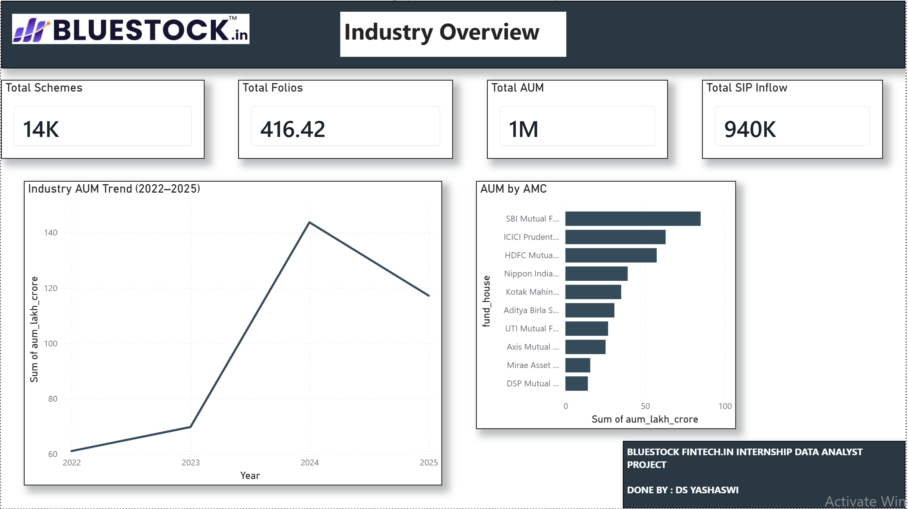
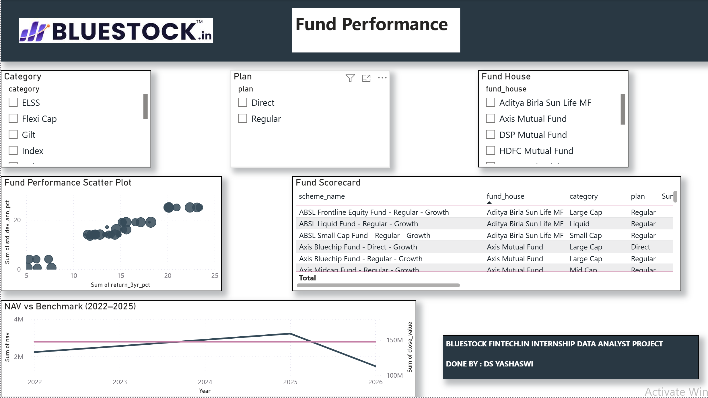
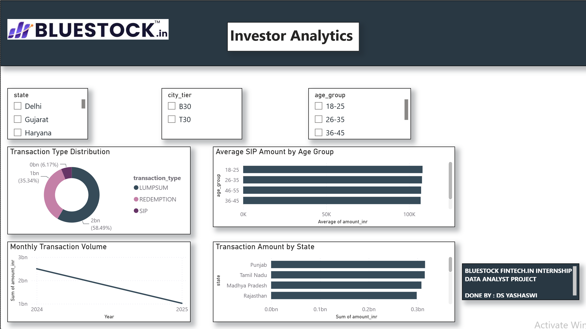
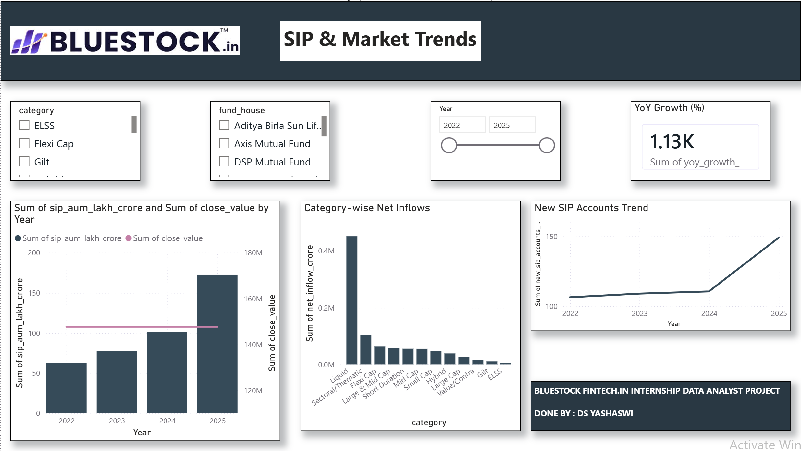

# 📊 Mutual Fund Analytics Dashboard

A complete end-to-end Data Analytics Capstone Project developed during the Bluestock Fintech Internship.

The project analyzes Mutual Fund data using Python, SQL, and Power BI to generate business insights on industry trends, fund performance, investor behavior, and SIP growth.

---

# Dashboard Preview

## Industry Overview



---

## Fund Performance



---

## Investor Analytics



---

## SIP & Market Trends



---

# Project Objectives

- Analyze Mutual Fund industry growth
- Compare Fund House performance
- Study investor behavior
- Track SIP inflows over time
- Build interactive Power BI dashboards
- Generate business insights for decision-making

---

# Tech Stack

### Programming

- Python

### Data Processing

- Pandas
- NumPy

### Database

- SQLite
- SQL

### Visualization

- Power BI

### Version Control

- Git
- GitHub

---

# Project Workflow

Raw Data

↓

Data Cleaning (Python)

↓

SQLite Database

↓

Exploratory Data Analysis

↓

Power BI Dashboard

↓

Business Insights

---

# Folder Structure

```
mutual-fund-analytics
│
├── data
│   ├── raw
│   └── processed
│
├── notebooks
│
├── scripts
│
├── sql
│
├── reports
│
├── deliverables
│   ├── Power BI Dashboard (.pbix)
│   ├── Dashboard PDF
│   ├── Dashboard Screenshots
│
├── requirements.txt
├── data_dictionary.md
└── README.md
```

---

# Dashboard Pages

### Page 1 – Industry Overview

- KPI Cards
- Industry AUM Trend
- AUM by AMC

---

### Page 2 – Fund Performance

- Risk vs Return Scatter Plot
- NAV vs Benchmark
- Fund Scorecard
- Interactive Filters

---

### Page 3 – Investor Analytics

- Transaction Analysis
- SIP Distribution
- Monthly Transaction Trend
- State-wise Analysis

---

### Page 4 – SIP & Market Trends

- SIP Growth
- Category-wise Net Inflows
- New SIP Account Trend

---

# Key Business Insights

- Industry AUM experienced strong growth during the analysis period.
- SIP inflows consistently increased over time.
- Large-cap funds attracted the highest investments.
- Investor preferences varied across states and age groups.
- Risk-return analysis helps compare fund performance effectively.

---

# Deliverables

✔ Power BI Dashboard (.pbix)

✔ Dashboard Report (.pdf)

✔ Dashboard Screenshots

✔ Cleaned Dataset

✔ Python Scripts

✔ SQL Database

---

# Author

**Yashaswi**

Data Analytics Intern

Bluestock Fintech
